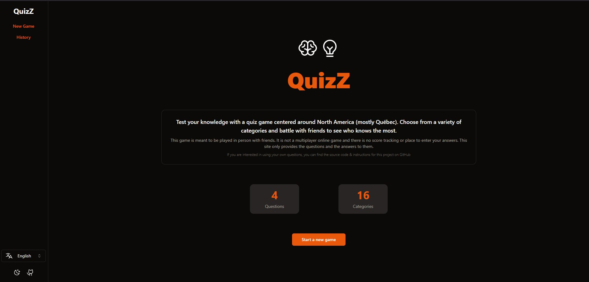
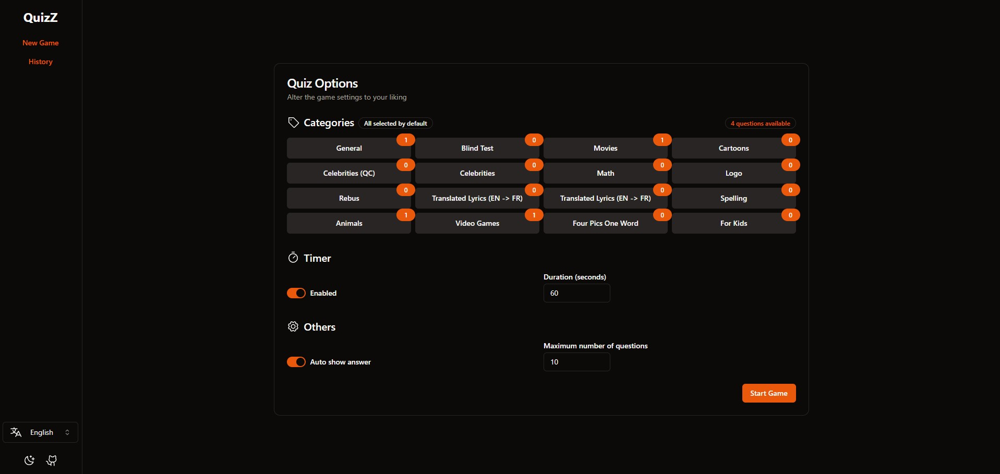
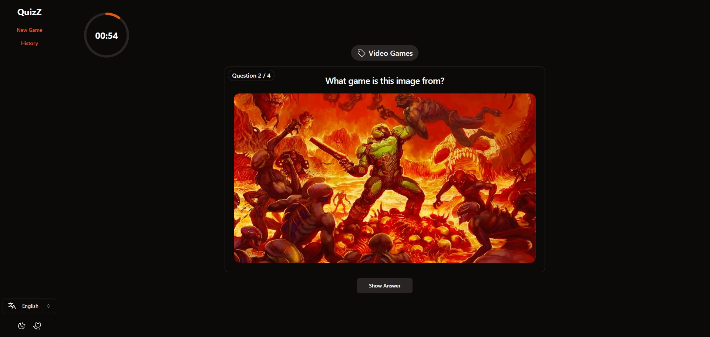
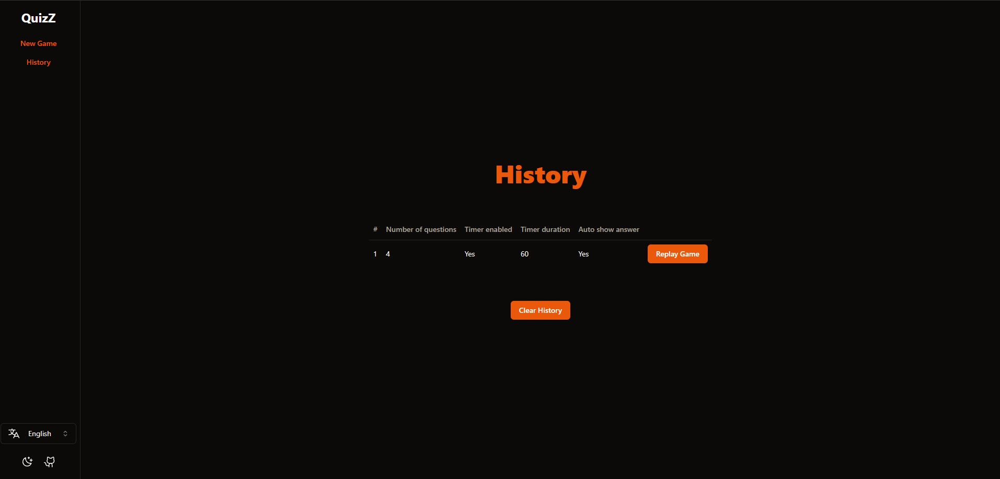

# QuiZz

## Description

This is a simple web app where you can answer questions and see the results. It is means to be played in person since there is no score tracking or place to enter your answers. This site only provides the questions and the answers to them. Each questions has a difficulty level and a category. Difficuly levels is purely subjective and meant for our own use.

They may be some errors in the questions, I apologize in advance. Also, the english questions where translated from french, sorry for the mistakes.

## Use your own questions

If you want to use your own questions, you can fork this project
and changes the .json files in the `src/content/questions` folder.
After that, you can build the project and deploy it. Since it's a static site, you can host it on GitHub Pages, Netlify, Vercel, or any other static site hosting service.

## Screenshots

## TODO

- Add questions
- Optimize image/video/audio (@unpic/solid / compress)
- Bypass chrome autoplay policy
